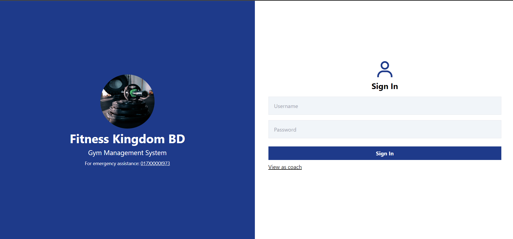
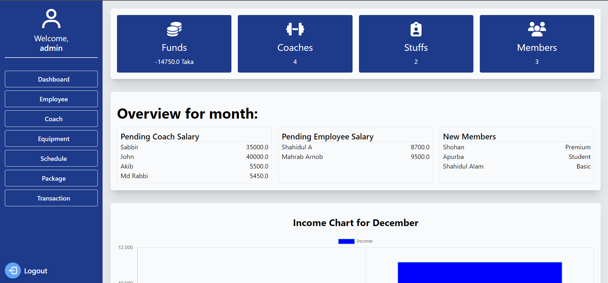
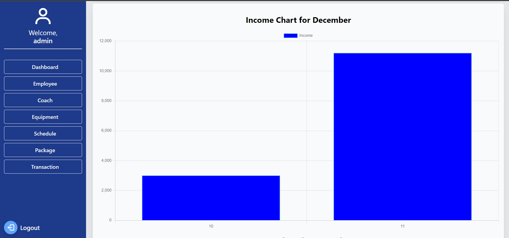
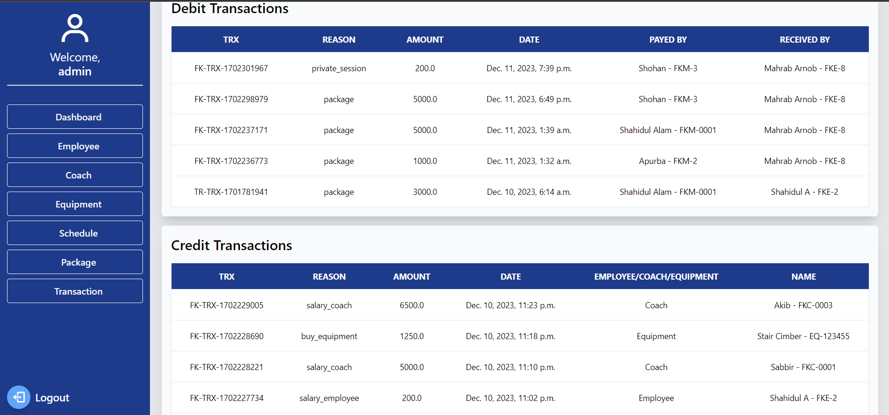
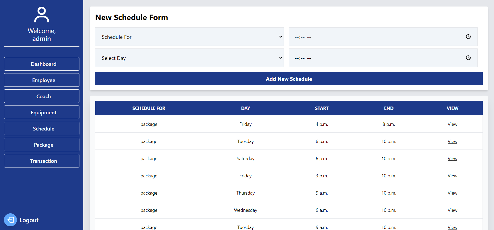
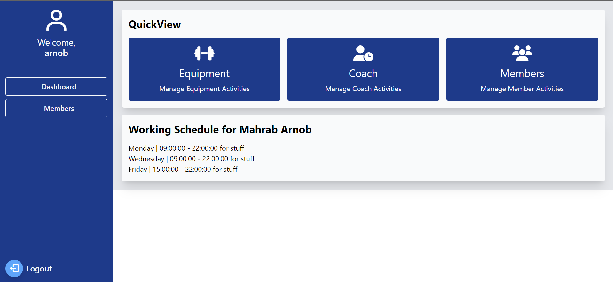

# Gym Management System (Django)

## Table of Contents
- Introduction
- Features
- Tech Stack
- Installation
- Usage
- Screenshots
- Contributing
- License
- Acknowledgments
- Contact
## Introduction
The Gym Management System is a powerful web application developed using Django that simplifies the management of a gym facility. This comprehensive system allows gym managers and employees to streamline their daily operations, enhance member experiences, and improve overall efficiency.
## Features
### Manager (Super User)
- **Employee Management**: The Manager, as a super user, can create and modify employee records. They have the authority to manage the employee database, including personal details, contact information, and job roles. This feature ensures smooth coordination and efficient management of the gym staff.
- **Equipment Management**: The Manager can create new equipment records, update existing ones, and maintain an accurate inventory. This feature enables better organization and maintenance of gym equipment, ensuring members have access to high-quality resources.
- **Gym Membership Packages**: The Manager can create customized gym membership packages to cater to diverse member needs. They can define packages, such as Basic, Premium, Student, and Individual, each with unique benefits and pricing options.
- **Schedule Management**: The Manager can create gym membership packages, and employees, and coach's schedules. This flexible scheduling feature optimizes resource allocation, facilitates efficient planning of workout sessions, and ensures a smooth flow of operations.
- **Salary Management**: The Manager can set and manage salaries for employees and coaches. This ensures accurate and timely compensation for staff members, fostering a positive work environment.
- **Dashboard**: The Manager can access a comprehensive dashboard providing an overview of the gym's records. They can view income and expense charts, and credit and debit transactions, and gain insights into the overall financial performance of the gym.
### Employee
- **User Authentication**: Employees can log in to the system using the credentials assigned by the Manager. This ensures secure access to the system and restricts unauthorized usage.
- **Attendance Management**: Employees can mark their attendance within their scheduled working hours. The Manager determines these schedules and assigns them to employees. Additionally, employees can mark attendance on behalf of coaches if they are present during the scheduled time.
- **Due Bill Collection**: Employees can collect due bills from gym members. During the collection process, the system verifies the member's profile status, ensuring it is active, and validates if the member is paying for the correct membership package.
- **Equipment Booking**: Employees can book equipment on behalf of gym members. The system validates the member's package details and checks if the equipment is included in their package. It also verifies if the booking schedule falls within the member's daily schedule as per their package.
- **Private Coach Session**: Employees can book private coach sessions for members. The system checks the booking price, where premium package members enjoy the booking fee of 200 Taka, while others pay 400 Taka. Additionally, the system checks if the selected coach has available and if the booking time is within the member's schedule.
## Tech Stack
The Gym Management System is built using the following technologies:
- Python
- Django
- HTML
- CSS
- JavaScript
- MySQL Database
## Installation
To install and run the Gym Management System locally, please follow these steps:
- Clone the repository: git clone [https://github.com/shz-code/fitness-kingdom-gym-ms.git](https://github.com/shz-code/fitness-kingdom-gym-ms.git)
- Navigate to the project directory: cd gym-management-system
- Create and activate a virtual environment (optional but recommended): 
- On Linux/Mac:     
```
    python3 -m venv venv 
    source venv/bin/activate 
```    
- On Windows:     
```bash 
    python -m venv venv 
    venv\Scripts\activate  
```
- Install the dependencies: ```pip install -r requirements.txt```
- Create a `.env` file in the **core** folder in the project directory. Set the required environment variables in the `.env` file. Refer to the `.env.example` file provided in the repository for details. 
- Create a database named **fitnessKindgom** in MYSQL before running the below commands:
- Perform database migrations: ```python manage.py migrate```
- Start the development server: ```python manage.py runserver```
- Open your web browser and access the application at http://localhost:8000
## Usage
- **Manager Account Creation**: Create a superuser using ```python manage.py createsuperuser``` to create manager account.
- **Manager Login**: Use the Manager account credentials to log in to the system.
- **Manager Dashboard**: Access the Manager Dashboard to gain insights into gym records, and financial performance, and manage various aspects of the gym.
- **Employee Login**: Employees can log in to the system using the credentials assigned by the Manager.
- **Attendance Management**: Employees can mark their attendance during their scheduled working hours. They can also mark attendance for coaches if they are absent during their scheduled time.
- **Due Bill Collection**: Employees can collect the due bills of members, ensuring accuracy and adherence to membership packages.
- **Equipment Booking**: Employees can book equipment for members to use. The system validates the availability of equipment, member's package details, and booking schedule.
- **Private Coach Session**: Employees can book private coach sessions for members. The system checks the booking price, coach availability, and member's schedule.
## Screenshots
- Login Page. Managers and employees can log in with their credentials.

- Admin Dashboard


- Admin panel transaction history

- Schedule management

- Employee Dashboard (Not updated)
 
## Contributing
Contributions to the Gym Management System project are welcome! If you have any ideas for improvements or new features, feel free to open an issue or submit a pull request. Please ensure that your contributions adhere to the project's coding standards and guidelines.
## License
This project is licensed under the MIT License. Feel free to use, modify, and distribute the code for personal and commercial purposes.
## Acknowledgments
- The design was inspired.
## Contact
For any questions or inquiries, please at web.shahidul.alam@gmail.com
